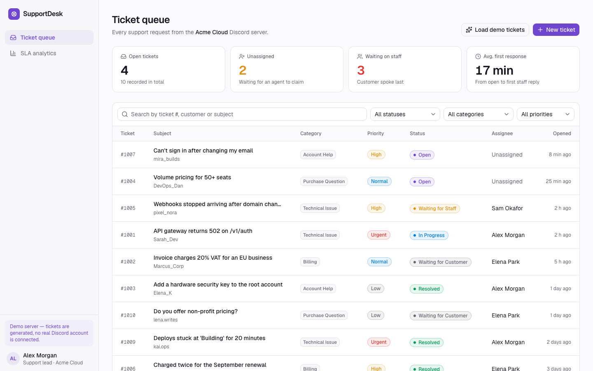
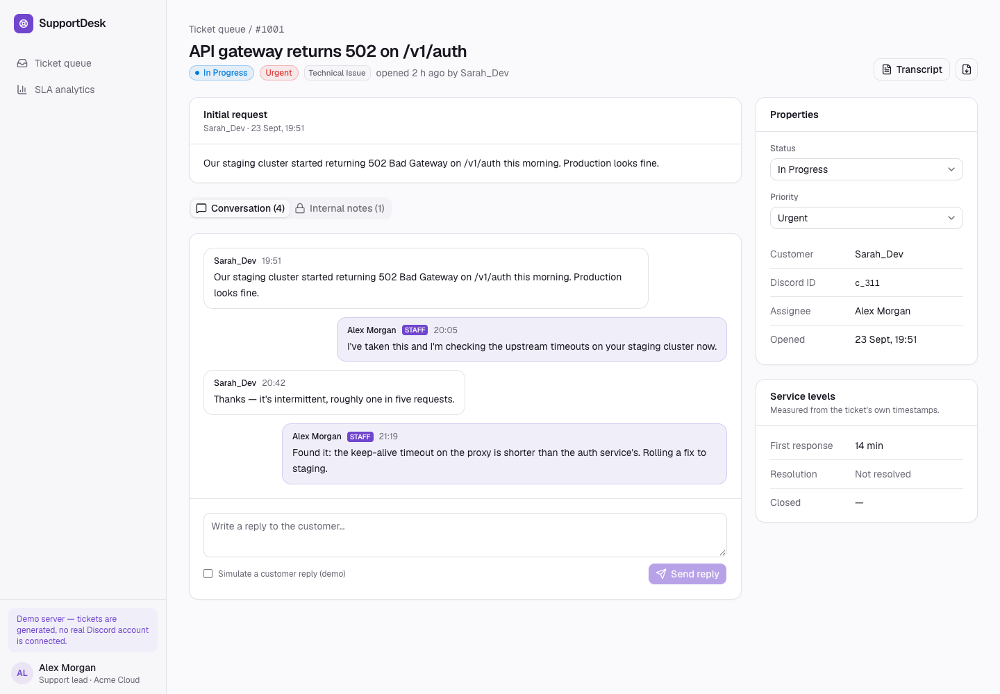
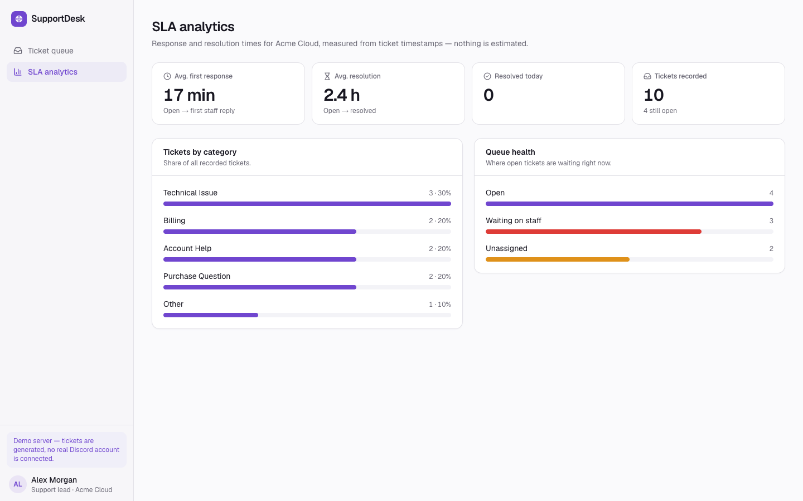
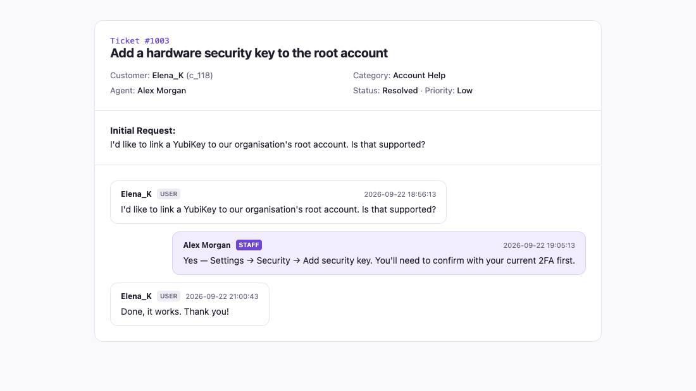
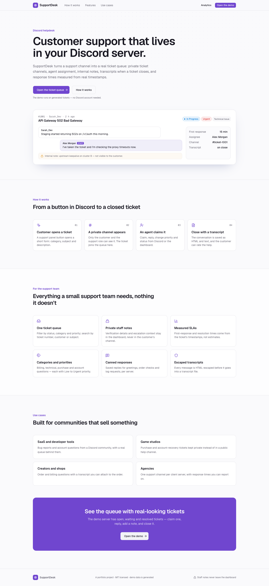
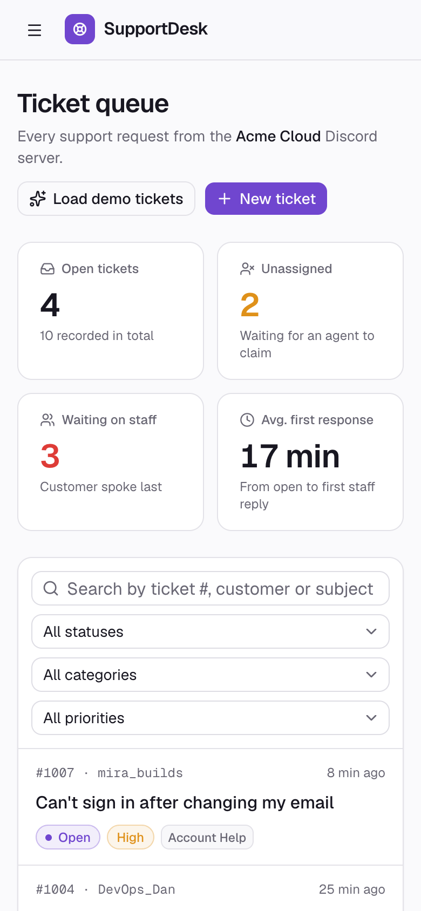
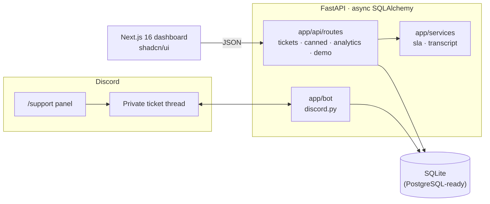
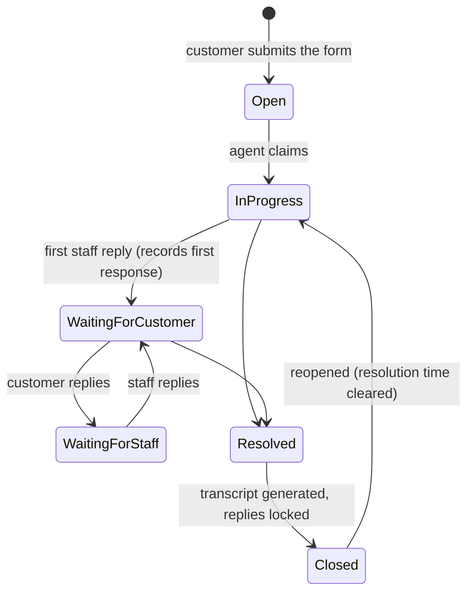

# SupportDesk

**Portfolio case study:** [moeijiro.github.io/portfolio/projects/supportdesk](https://moeijiro.github.io/portfolio/projects/supportdesk/) · **Live demo:** not hosted — the app runs locally in a few commands (see below).

**Customer support that lives in your Discord server.** SupportDesk turns a support
channel into a real ticket queue. Customers open tickets from a panel in Discord and get
a private thread. Agents claim, reply, prioritise and close tickets from Discord or the
dashboard. Every closed ticket leaves an HTML and plain-text transcript, and response
times are measured from the tickets' own timestamps.

It is a helpdesk for one community, not a multi-tenant SaaS. There are no accounts or
roles in the dashboard: it trusts whoever can reach it (see
[Known limitations](#known-limitations)).

> Portfolio project. The demo server "Acme Cloud", its customers and agents are
> fictional. The tickets are generated by the seed script.



| Ticket with conversation, notes and SLA | SLA analytics |
| --- | --- |
|  |  |
| **HTML transcript (generated on close)** | **Landing page** |
|  |  |

<p align="center"></p>

## Contents

- [Features](#features)
- [Architecture](#architecture)
- [Ticket lifecycle](#ticket-lifecycle)
- [Security](#security)
- [API overview](#api-overview)
- [Getting started](#getting-started)
- [Demo walkthrough](#demo-walkthrough)
- [Testing](#testing)
- [Environment variables](#environment-variables)
- [Known limitations](#known-limitations)

## Features

**In Discord (`python -m app.bot`)**

- `/support` posts a panel. Its button opens a form (category, subject, description) and
  creates a private thread for the ticket.
- Buttons in the ticket thread: **Claim** and **Close & archive**. Slash commands
  `/claim`, `/close` and `/priority` do the same.
- Messages in a ticket thread are recorded on the ticket, and staff replies count
  towards the first-response time.

**In the dashboard**

- **Queue:**
  - Filter by status, category and priority.
  - Debounced search by ticket number, customer or subject.
  - A card list on phones.
- **Ticket workspace:**
  - The conversation, with an option to simulate a customer reply for demos.
  - Private internal notes.
  - Status and priority controls.
  - Measured first-response and resolution times.
  - The customer's rating.
- **SLA analytics:**
  - Average first response and average resolution.
  - Tickets resolved today.
  - Tickets by category.
  - Queue health: open, waiting on staff, unassigned.
- **Transcripts:** an HTML download on close, with every message escaped, plus a
  plain-text version.

**Rules the API enforces**

- Statuses, priorities and categories are validated.
- Closed tickets don't accept replies.
- Reopening a ticket clears its resolution and close times, so SLAs stay truthful.
- Only resolved or closed tickets can be rated.
- Loading the demo is idempotent.

## Architecture



```
backend/app
├── api/routes/     tickets, canned, analytics, demo
├── bot/            discord.py client, panel/modal/ticket views, python -m app.bot
├── models/         server (GuildConfig, CannedResponse), ticket (Ticket, messages, notes, audit)
├── schemas/        request/response models with validated enums
├── services/       sla (measured response times), transcript (escaped HTML + text)
├── db/             base, async session
└── seed.py         demo data: python -m app.seed [--reset]
frontend/src
├── app/            landing, (app)/dashboard, (app)/tickets/[id], (app)/analytics
└── components/     kit/ (shared house style), desk pills, new-ticket dialog
```

## Ticket lifecycle



Priorities are `Low`, `Normal`, `High` and `Urgent`. Categories are `Billing`,
`Technical Issue`, `Purchase Question`, `Account Help` and `Other`.

## Security

| Concern | What SupportDesk does |
| --- | --- |
| Transcript injection | Every author name, message, subject and ID is HTML-escaped before it goes into a transcript. |
| Invalid state | Status, priority and category are validated enums. Invalid transitions (reply to closed, rate unresolved) return 409. |
| Private notes | Stored separately from messages and never posted to the customer's thread. |
| Secrets | The bot token is read from the environment only. |
| Dashboard access | **Not authenticated.** See [Known limitations](#known-limitations). |

## API overview

Interactive docs are at `http://localhost:8000/docs`. All paths start with `/api/v1`.

| Method | Path | |
| --- | --- | --- |
| GET / POST | `/tickets/{guild}` | List with filters and search, or open a ticket |
| GET | `/tickets/{guild}/{id}` | Ticket with messages and notes |
| POST | `/tickets/{guild}/{id}/claim` | Assign an agent |
| POST | `/tickets/{guild}/{id}/status` | Change status (validated) |
| POST | `/tickets/{guild}/{id}/priority` | Change priority |
| POST | `/tickets/{guild}/{id}/messages` | Add a staff or customer message |
| POST | `/tickets/{guild}/{id}/notes` | Add a private note |
| GET | `/tickets/{guild}/{id}/transcript?format=html\|text` | Download the transcript |
| POST | `/tickets/{guild}/{id}/rate` | Customer rating (resolved tickets only) |
| GET / POST | `/canned/{guild}` | Saved replies |
| GET | `/analytics/{guild}/overview` | Measured SLA figures and queue counts |
| GET | `/analytics/{guild}/categories` | Tickets per category |
| POST | `/demo/seed` | Load the demo server (idempotent) |

## Getting started

Requirements: Python 3.12+ and Node 20+.

```bash
make install        # backend venv + frontend deps
make seed           # demo server and a week of tickets (resets the local database)
make api            # http://localhost:8000
make web            # http://localhost:3000
```

Without make:

```bash
cd backend && python3 -m venv .venv && .venv/bin/pip install -r requirements-dev.txt
cp ../.env.example ../.env
.venv/bin/python -m app.seed --reset
.venv/bin/uvicorn app.main:app --port 8000
cd ../frontend && npm install && npm run dev
```

### Running the Discord bot

1. Create an application in the Discord developer portal, add a bot, enable the
   **Message Content** intent (ticket messages are recorded), and copy its token into
   `DISCORD_BOT_TOKEN`.
2. Invite the bot with the `applications.commands` and `bot` scopes. It needs the
   Send Messages, Create Private Threads and Manage Threads permissions.
3. Run it next to the API with `cd backend && .venv/bin/python -m app.bot`. It shares
   the API's database.
4. Use `/support` in a channel to post the ticket panel.

## Demo walkthrough

1. Open `http://localhost:3000/dashboard`. The queue has open, waiting and resolved
   tickets.
2. Open ticket **#1004** (unassigned), press **Claim ticket**, and reply. The first
   staff reply records the first-response time and moves the ticket to *Waiting for
   Customer*.
3. Tick **Simulate a customer reply** and answer. The ticket moves back to *Waiting for
   Staff*.
4. Add a note under **Internal notes**.
5. Set the status to **Closed**. Resolution time is recorded, replies lock, and
   **Transcript** opens the HTML archive.

## Testing

```bash
make test           # 8 tests
```

The tests cover:
- the ticket lifecycle
- demo seeding, including seeding twice
- validation of statuses, priorities and categories
- closed tickets refusing replies, and reopening clearing the resolution
- rating rules
- transcript generation and escaping
- SLA calculation

CI runs the backend tests, then lints and builds the frontend
([.github/workflows/ci.yml](.github/workflows/ci.yml)).

## Environment variables

See [.env.example](.env.example).

| Variable | Default | |
| --- | --- | --- |
| `DATABASE_URL` | `sqlite+aiosqlite:///./supportdesk.db` | Any async SQLAlchemy URL |
| `CORS_ORIGINS` | `http://localhost:3000,…` | Browser origins allowed to call the API |
| `DISCORD_BOT_TOKEN` | — | Only needed for `python -m app.bot` |

## Known limitations

- **No sign-in on the dashboard or API.** Anyone who can reach it and knows a server ID
  can read and change tickets. Put it behind your own auth, such as a reverse proxy
  with SSO, or add Discord OAuth before exposing it.
- Agent identity in the dashboard is fixed to the demo agent. There's no agent picker.
- The Discord bot's persistent buttons don't survive a bot restart (views aren't
  re-registered on startup).
- If the server can't create private threads, the bot falls back to a public thread and
  says so in the log.
- Staff are recognised by a role whose name contains "staff" or "support", or by the
  Manage Channels permission.
- Canned responses can be stored and listed but aren't offered in the ticket workspace
  yet.

## License

MIT © Moeijiro
