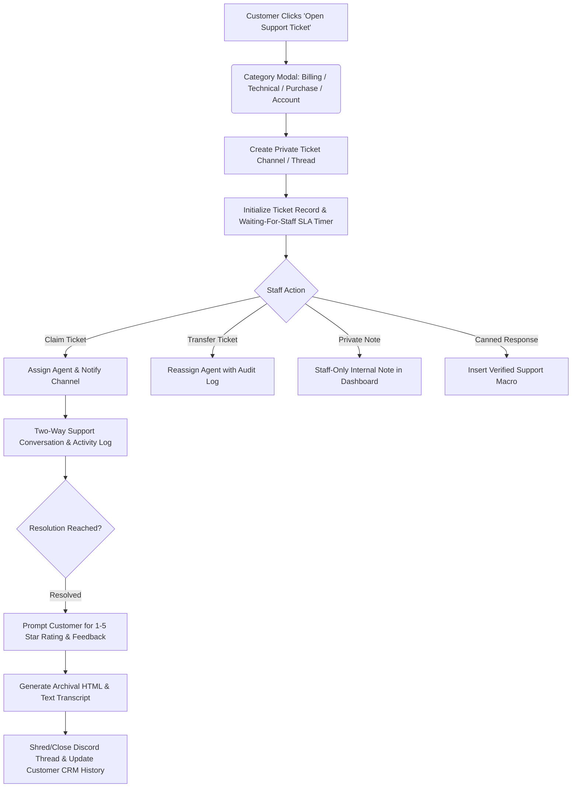

# SupportDesk

[](https://github.com/Moeijiro/supportdesk/actions/workflows/ci.yml)
[](https://opensource.org/licenses/MIT)
[](https://fastapi.tiangolo.com/)
[](https://discordpy.readthedocs.io/)
[](https://nextjs.org/)

> **SupportDesk** is a customer support and CRM platform built around Discord. It elevates Discord ticket management into a structured help desk environment featuring category routing, agent claim/transfer workflows, private internal notes, automated HTML/plain-text transcripts, SLA tracking, and a full-featured staff dashboard.


| Ticket with conversation, notes and SLA | SLA analytics |
| --- | --- |
|  |  |
| **HTML transcript (generated on close)** | **Landing page** |
|  |  |

<p align="center"></p>

---

## Support Lifecycle Architecture



---

## Key Features

- 🎫 **Structured Category Routing**: Directs queries into categorized queues (`Billing`, `Technical Issue`, `Purchase Question`, `Account Help`, `Other`) with custom initial modals.
- 🔒 **Private Channel Isolation**: Auto-provisions private channels/threads restricted strictly to the ticket creator, assigned agents, and support administrator roles.
- 📝 **Private Internal Staff Notes**: Support staff can record confidential troubleshooting notes, user verification details, and escalation logs visible only inside the dashboard.
- ⚡ **Measured SLA Metrics & Timers**: Tracks actual first-response times, resolution durations, and waiting-state timers (`Waiting for Staff` vs `Waiting for Customer`) without fake or extrapolated numbers.
- 📜 **Archival Transcript Generation**: Automatically compiles conversational logs into downloadable HTML and plain-text transcripts with author IDs and media metadata.
- 💬 **Canned Response Macros**: Staff can dispatch vetted support answers directly from the dashboard or via interactive slash/menu commands.
- 🌟 **Post-Resolution Customer Feedback**: Non-intrusive 1–5 star rating prompt with optional feedback comments stored alongside customer support profiles.
- 🖥️ **Linear/Zendesk Inspired Staff Portal**: Modern Next.js dashboard featuring priority badges, status toggles, conversation timelines, search by ticket/username, and customer history panels.
- 🎭 **Built-in Offline Demo Mode**: Explore populated tickets, staff workloads, and transcripts without needing live Discord server access.

---

## Ticket Lifecycle States & Priorities

### Statuses
* `Open`: Newly initiated by customer, awaiting initial agent response.
* `Waiting for Staff`: Customer sent a follow-up, SLA response timer running.
* `Waiting for Customer`: Agent replied, awaiting member action.
* `In Progress`: Agent is actively investigating the ticket.
* `Resolved`: Issue solved, pending customer sign-off and rating.
* `Closed`: Transcript compiled and archived, thread locked.

### Priorities
`Low` • `Normal` • `High` • `Urgent`

---

## API Reference

| Method | Endpoint | Description |
|---|---|---|
| `GET` | `/api/v1/tickets/{guild_id}` | List tickets with filters (status, category, priority, agent) |
| `POST` | `/api/v1/tickets/{guild_id}` | Create a support ticket from panel/modal |
| `GET` | `/api/v1/tickets/{guild_id}/{ticket_id}` | Ticket details, timeline, messages, and internal notes |
| `POST` | `/api/v1/tickets/{guild_id}/{ticket_id}/claim` | Claim or assign ticket to an agent |
| `POST` | `/api/v1/tickets/{guild_id}/{ticket_id}/status` | Update ticket status (`In Progress`, `Resolved`, `Closed`) |
| `POST` | `/api/v1/tickets/{guild_id}/{ticket_id}/priority` | Change priority rating (`Low`, `Normal`, `High`, `Urgent`) |
| `POST` | `/api/v1/tickets/{guild_id}/{ticket_id}/notes` | Add staff-only internal private note |
| `GET` | `/api/v1/tickets/{guild_id}/{ticket_id}/transcript` | Download compiled HTML/text transcript |
| `POST` | `/api/v1/tickets/{guild_id}/{ticket_id}/rate` | Record customer satisfaction rating (1-5) |
| `GET` | `/api/v1/analytics/{guild_id}` | Helpdesk telemetry (SLA, categories, volume) |
| `POST` | `/api/v1/demo/seed` | Seed realistic demo tickets and transcripts |

---

## Tech Stack

- **Backend**: Python 3.12+, FastAPI, SQLAlchemy 2.0 (async, aiosqlite), `discord.py 2.4`, Pydantic v2, pytest
- **Frontend**: Next.js 16, React 19, TypeScript, Tailwind CSS 4, shadcn/ui (Radix), Lucide icons, Geist
- **Database**: SQLite (Dev) / PostgreSQL (Production ready)
- **CI**: GitHub Actions — backend tests, then frontend lint and production build

---

## Getting Started

### Backend Setup

```bash
cd backend
python3 -m venv .venv
source .venv/bin/activate
pip install -r requirements.txt -r requirements-dev.txt
cp .env.example .env

pytest
uvicorn app.main:app --reload --port 8000
```

### Frontend Setup

```bash
cd frontend
npm install
cp .env.example .env.local
npm run dev
```

Visit `http://localhost:3000/dashboard` and press **Load demo tickets** (safe to press again; seeding is idempotent).

### Demo walkthrough

1. Open ticket **#1004** (unassigned) → **Claim ticket** → reply. The first staff reply records the first-response time and moves the ticket to *Waiting for Customer*.
2. Tick **Simulate a customer reply** and answer as the customer — the ticket moves back to *Waiting for Staff*.
3. Switch to **Internal notes** and add one; notes are never sent to the customer's channel.
4. Set the status to **Closed** — resolution time is recorded, replies are locked, and the HTML/text transcript is generated.

---

## License

MIT © [Moeijiro](https://github.com/Moeijiro)
